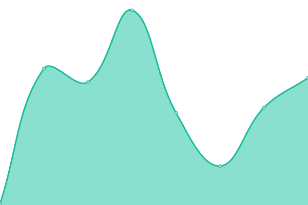
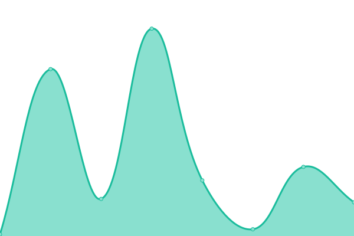
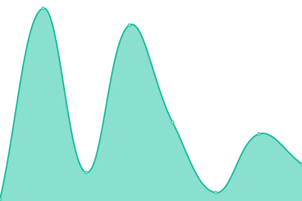

# [📈 Live Status](https://pl44t.github.io/pl44t-upptime): <!--live status--> **🟩 All systems operational**

This repository contains the open-source uptime monitor and status page for [pl44t](https://pl44t.github.io/pl44t-upptime), powered by [Upptime](https://github.com/upptime/upptime).

With [Upptime](https://upptime.js.org), you can get your own unlimited and free uptime monitor and status page, powered entirely by a GitHub repository. We use [Issues](https://github.com/pl44t/pl44t-upptime/issues) as incident reports, [Actions](https://github.com/pl44t/pl44t-upptime/actions) as uptime monitors, and [Pages](https://pl44t.github.io/pl44t-upptime) for the status page.

<!--start: status pages-->
<!-- This summary is generated by Upptime (https://github.com/upptime/upptime) -->
<!-- Do not edit this manually, your changes will be overwritten -->
<!-- prettier-ignore -->
| URL | Status | History | Response Time | Uptime |
| --- | ------ | ------- | ------------- | ------ |
|  [Daily Games](https://pl44t.github.io/DailyGames/) | 🟩 Up | [daily-games.yml](https://github.com/pl44t/pl44t-upptime/commits/HEAD/history/daily-games.yml) | 

 113ms
     
 | 

<a href="https://pl44t.github.io/pl44t-upptime/history/daily-games">100.00%</a>
    

|  [Tetris](https://pl44t.github.io/Tetris/) | 🟩 Up | [tetris.yml](https://github.com/pl44t/pl44t-upptime/commits/HEAD/history/tetris.yml) | 

 53ms
     
 | 

<a href="https://pl44t.github.io/pl44t-upptime/history/tetris">100.00%</a>
    

|  [Projects Timeline](https://pl44t.github.io/projects-timeline/) | 🟩 Up | [projects-timeline.yml](https://github.com/pl44t/pl44t-upptime/commits/HEAD/history/projects-timeline.yml) | 

 54ms
     
 | 

<a href="https://pl44t.github.io/pl44t-upptime/history/projects-timeline">100.00%</a>
    

|  [D&D game](https://pl44t.github.io/browser-d-d-game/) | 🟩 Up | [d-and-d-game.yml](https://github.com/pl44t/pl44t-upptime/commits/HEAD/history/d-and-d-game.yml) | 

 54ms
     
 | 

<a href="https://pl44t.github.io/pl44t-upptime/history/d-and-d-game">100.00%</a>
    

|  [Plaatsite](https://pl44t.github.io/plaatsite/) | 🟩 Up | [plaatsite.yml](https://github.com/pl44t/pl44t-upptime/commits/HEAD/history/plaatsite.yml) | 

 56ms
     
 | 

<a href="https://pl44t.github.io/pl44t-upptime/history/plaatsite">100.00%</a>
    

<!--end: status pages-->

[**Visit our status website →**](https://pl44t.github.io/pl44t-upptime)

## 📄 License

- Powered by: [Upptime](https://github.com/upptime/upptime)
- Code: [MIT](./LICENSE) © [Anand Chowdhary](https://anandchowdhary.com), supported by [Pabio](https://pabio.com)
- Data in the `./history` directory: [Open Database License](https://opendatacommons.org/licenses/odbl/1-0/)
